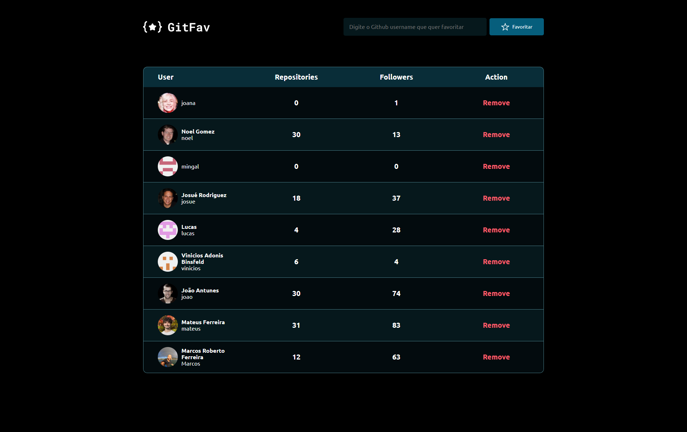

# explorer-desafio-GitFav
 Desafio para recriar uma buscar dos usúarios preferidos do github

  

## 🖥️ Projeto
Desafio do stage 6 da rocketseat, pude praticar bastante conceitos importantes na programação, como programação orientada a objeto, desistruturação, import e export além de trabalhar com API, também foi estudado assicronismo de diferentes formas e tratamento de erros.

## 🚀 Tecnologias
Foi desenvolvido esse projeto com as seguintes tecnologias:

- HTML
- CSS
- JAVASCRIPT
- FIGMA
- GIT
- GITHUB

## 👀 Ver
Aqui você pode visualizar o layout do projeto:
<a href="https://www.figma.com/file/05MR9R5YkxeTfyFdEkq1u0/%5BDesafios-Explorer%5D-GitFav-(Copy)-(Copy)?type=design&node-id=205-951&mode=design">clique aqui</a>
